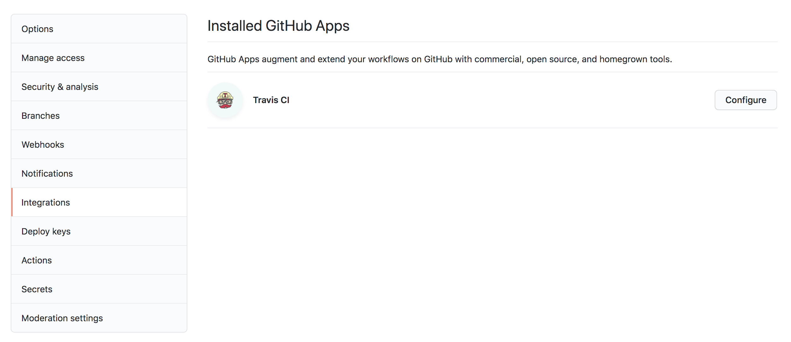
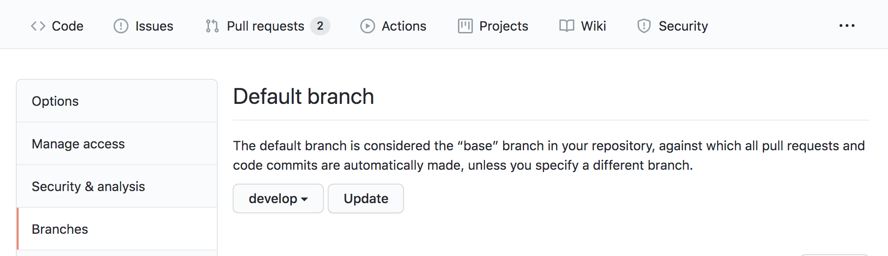

# About this project

Sample project for TechLadies CI/CD with Travis & Heroku

##### Running locally

1. Install dependencies using `npm install`
2. Run the server `npm start`

##### Running tests

Run `npm test` to run tests

## Presentation Link
https://docs.google.com/presentation/d/143lEMhGK92ZCnNohMO1blXDfKaJUxFQdmPHDatPugzY/edit?usp=sharing

## Pre-requisites

1. Go to Travis CI website and Sign up with GitHub.
2. Go to Heroku.com and sign up for an account.
3. Install Travis CI CLI: https://github.com/travis-ci/travis.rb#installation
4. Install Heroku CLI: https://devcenter.heroku.com/articles/heroku-cli

Make sure you can successfully login, using the CLIs, with:

```
// for heroku
heroku login

// for travis
travis login --pro
```

----

# How to setup CI/CD with Travis & Heroku?

This tutorial will walkthrough the process of setting up CI/CD for a simple Nodejs app on Heroku, using Travis CI.

To get started, create a new repository using [this](https://github.com/TechLadies/cicd-tutorial) template. This template contains code for a simple node server, serving a single route and a test for the same.


## Continuous Integration (CI)

Continuous Integration is the process of merging and testing small code changes frequently. We will use Travis CI to run our tests for every commit, to ensure that new changes do not break our code.

### Add Travis CI/CD application to your repository

Go to https://travis-ci.com/ and login with your Github account. Give Travis access to your repository.

If you already have Travis installed, you can also add Travis to the repository on from page https://github.com/settings/installations.

Verify that Travis is installed by checking `Integrations` under `Settings`. Travis should be listed as shown below.



### Add Travis build config

To configure Travis, we need to add a `.travis.yml` file. This file allows you to customize your Travis builds. For eg, you can run linting, tests, trigger deploys, run post deploy scripts etc. You can learn more about the build config [here](https://config.travis-ci.com/).

Create a new file `.travis.yml`. Make note of the preceeding `.` infront of the filename.

Add the following contents to the `.travis.yml` file. This sets up the basic environment for our build.

```yaml
language: node_js
node_js:
  - 10.13.0
install:
  - npm install
```

### Setup Travis to run tests

Our environment is configured in Travis. We will now run our tests as part of every build. Unit tests allow us to verify code changes and safeguard against regression errors.

Add a `script` block to the `.travis.yml` file to trigger `npm test` to run tests for each commit.

Your `.travis.yml` file should now look like this:
```yaml
language: node_js
node_js:
  - 10.13.0
install:
  - npm install
script:
  - npm test
```

Push this to `master`. Notice the green tick next to your commits.


You can click on the green checkmark, to see details about the Travis build.


### Break the build

Let us test the above.

In a new branch, update `server.js` to show a different message for the `GET /` route.

```js
app.get('/', (req, res) => {
  res.json('Hello amazing Techladies!')
})
```

Note the red cross, indicating that the checks failed.


### Bonus: Add branch protection

You can add branch protection as shown below, to disable merging unless the build passes.


## Continuous Deployment (CD)

Continuous Deployment is the process of automated deployments.

Production systems usually have multiple stages for deploying.

For our tutorial, we will have,
* `staging` environment - for pre-release versions, to conduct internal testing & verification before releasing to the live website
* `production` environment - openly accessible released version

### Setup `staging` environment

Create a branch `develop`. Set this branch as the default branch. We will use this branch as `staging` branch.



Now, in your Heroku dashboard, create a new app for staging, for eg, `techladies-ci-cd-2020-staging` and add the `branches` and `deploy` blocks to `.travis.yml` as listed below,

```yaml
language: node_js
node_js:
  - 10.13.0
install:
  - npm install
script:
  - npm run test
branches:
  only:
    - develop
deploy:
  provider: heroku
  api_key:
    secure: ADD_API_KEY_HERE
  app:
    develop: ADD_STAGING_APP_NAME_HERE
```

Make sure you replace `ADD_STAGING_APP_NAME_HERE` with the name of the staging app that you created on Heroku.

Replace `ADD_API_KEY_HERE` with your encrypted Heroku API key. Generate it with the following command:

```
travis encrypt $(heroku auth:token) –-pro
```

Push the changes to your `develop` branch. Travis will autodeploy your branch to the Heroku staging app.

> Note:  If when using the generated API key, your build fails with an "Invalid Credentials" error, replace `$(heroku auth:token)` with the your actual Heroku API key from the Heroku Settings Page and use that encrypted value/
### Setup `production` environment

Yay! You have verified your new functionality in your `develop` branch in the staging environment. It is now ready to be deployed to the world!

Create a new app on Heroku to use as your production app. Then,
- add `master` under `branches`
- add your production app name for `master` under `app`

Your `.travis.yml` should now look like,
```yaml
language: node_js
node_js:
  - 10.13.0
install:
  - npm install
script:
  - npm run test
branches:
  only:
    - develop
    - master
deploy:
  provider: heroku
  api_key:
    secure: ADD_API_KEY_HERE
  app:
    develop: ADD_STAGING_APP_NAME_HERE
    master: ADD_PRODUCTION_APP_NAME_HERE
```

Travis can now autodeploy your `master` branch to your production app.

### Adding more to staging!

Add a new route, in `server.js`, in the `develop` branch

```js
app.get('/:name', (req, res) => {
  res.json(`Hello ${req.params.name}!`)
})
```

Wait for the staging deploy to complete. Verify that this new route is only available on `techladies-ci-cd-2020-staging` and not deployed to our production app - `techladies-ci-cd-2020-prod`.

----
## Sources

* https://codesource.io/ci-cd-with-github-travis-ci-and-heroku/
* https://blog.bitsrc.io/automate-your-deployment-on-heroku-eba486b95470
* https://devcenter.heroku.com/articles/getting-started-with-nodejs?singlepage=true